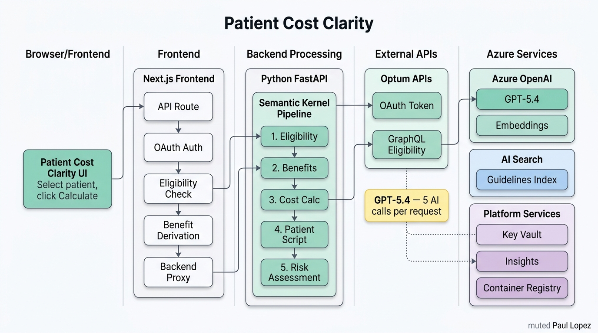

# Patient Cost Clarity

## Professional Context and IP Notice

This prototype is a reference design built to demonstrate the type of
work I do as an AI architect in healthcare and enterprise contexts. It
does not contain proprietary information, client data, trade secrets,
internal systems knowledge, or confidential materials from any current
or former employer or their clients. All data is synthetic, all
architecture patterns are based on publicly available technologies and
standards, and all code was written independently on personal equipment
outside of employment obligations.

The scenarios and domain context (prior authorization, denial
management, payer operations) reflect publicly understood healthcare
industry problems, not any specific client engagement or internal system.

---

> **Live demo:** https://patient-cost-clarity-starter.vercel.app/
> To see a live working demo, contact me.

A working Next.js starter that demonstrates how to use the Optum Real Pre-Service Eligibility API (GraphQL) with AI to give patients a plain-English answer to the question every patient asks before a medical visit: "What is this actually going to cost me?"

This project includes two architectures: the original Anthropic Claude integration for Vercel deployment, and an Azure-native upgrade using Azure OpenAI GPT-5.4, Semantic Kernel, Azure AI Search (RAG), and Application Insights — deployed on Azure Container Apps with Bicep IaC.

---

## Architecture Upgrade: Before and After



### Before — Next.js Monolith + Anthropic Claude

```
Browser
  └── Next.js (Vercel)
        └── POST /api/optum/cost-estimate
              ├── Optum OAuth + GraphQL
              └── Anthropic Claude API (single prompt call)
                    └── ClaudeCostAnnotation JSON
```

### After — Azure-Native with Semantic Kernel Agent Pipeline

```
Browser
  └── Next.js Frontend (port 3000, Docker or Vercel)
        └── POST /api/optum/cost-estimate
              ├── Optum OAuth + GraphQL (unchanged, server-side)
              └── POST /api/interpret → Python FastAPI Backend (port 8000, Docker)
                    └── Semantic Kernel Agent Pipeline
                          ├── Azure OpenAI GPT-5.4        ← inference (all 5 plugins)
                          ├── Azure OpenAI Embeddings    ← text-embedding-3-large
                          ├── Azure AI Search            ← RAG retrieval (hybrid search)
                          └── Application Insights       ← telemetry per plugin step
```

### Azure Stack Decisions

| Component | Original | Azure Upgrade | Why |
|---|---|---|---|
| AI Inference | Anthropic Claude (direct) | Azure OpenAI GPT-5.4 | Azure-native, Managed Identity auth, no API key in production |
| Agent Orchestration | Single prompt call | Semantic Kernel (5 plugins) | Step-level observability, testable units, SK is Microsoft's production framework |
| RAG / Knowledge Base | None (hardcoded prompt) | Azure AI Search (hybrid search) | Benefit rules updatable without redeployment; hybrid BM25 + vector is more accurate for structured content |
| Observability | Sandbox Dev Console | Application Insights | Production telemetry with per-plugin event tracking |
| Deployment | Vercel | Azure Container Apps | Native Azure integration; Managed Identity replaces all API keys |
| IaC | None | Azure Bicep | Microsoft-native IaC; single `az deployment group create` command |
| Secrets | Environment variables | Azure Key Vault | Production secret governance with Managed Identity access |

---

## What This Demonstrates

- **Optum Real API integration** — Calling the Pre-Service Eligibility API (GraphQL) to retrieve coverage status, plan levels, deductibles, copays, coinsurance, and service-level benefit details
- **Semantic Kernel plugin architecture** — Five-plugin sequential pipeline (Eligibility, Benefit, Cost, Script, Risk) with explicit invocation for predictable behavior
- **Azure OpenAI integration with Managed Identity** — GPT-5.4 for inference, text-embedding-3-large for RAG embeddings, Managed Identity auth in production
- **Hybrid RAG with Azure AI Search** — Vector + BM25 keyword search over CPT guidelines, cost calculation rules, and coverage rules
- **Application Insights telemetry** — Per-plugin event tracking with latency, token counts, and retrieved document titles
- **Bicep IaC for Container Apps** — Full Azure deployment with Container Apps, OpenAI, AI Search, Key Vault, ACR, and monitoring
- **Seven patient cost scenarios** — Routine low-cost visit, specialist with partial deductible, high-cost imaging, preventive care ($0), ER high exposure, behavioral health carve-out, and physical therapy visit limits
- **Runtime mode toggle** — Switch between mock and sandbox modes during a live demo without redeploying

## Tech Stack

- [Next.js](https://nextjs.org) 16 (App Router, React 19)
- [TypeScript](https://www.typescriptlang.org) 5
- [Tailwind CSS](https://tailwindcss.com) v4
- [shadcn/ui](https://ui.shadcn.com) components (base-vega style)
- [Hugeicons](https://hugeicons.com) for iconography
- [Framer Motion](https://www.framer.com/motion) for animations
- [next-themes](https://github.com/pacocoursey/next-themes) for dark/light mode
- [Bun](https://bun.sh) package manager
- [Python](https://python.org) 3.12 + [FastAPI](https://fastapi.tiangolo.com)
- [Semantic Kernel](https://learn.microsoft.com/en-us/semantic-kernel/) 1.14
- [Azure OpenAI Service](https://azure.microsoft.com/en-us/products/ai-services/openai-service) (GPT-5.4 + text-embedding-3-large)
- [Azure AI Search](https://azure.microsoft.com/en-us/products/ai-services/ai-search) (hybrid vector + BM25)
- [Azure Application Insights](https://learn.microsoft.com/en-us/azure/azure-monitor/app/app-insights-overview)
- [Azure Bicep](https://learn.microsoft.com/en-us/azure/azure-resource-manager/bicep/) for IaC

---

## Quick Start (Mock Mode)

No API keys, no credentials, no login required:

```bash
git clone https://github.com/paullopez-ai/patient-cost-clarity-starter.git
cd patient-cost-clarity-starter
bun install
bun dev
```

Open [http://localhost:3000](http://localhost:3000). All seven patient scenarios render with realistic data from local fixtures.

---

## Docker Compose (Azure Backend)

### Prerequisites

1. **Docker Desktop** installed and running
2. **Azure subscription** with the following resources provisioned:
   - Azure OpenAI Service with `gpt-5.4` and `text-embedding-3-large` deployments
   - Azure AI Search service (Basic tier)
   - (Optional) Application Insights for telemetry

### Setup

1. Clone the repo and copy the backend env file:
   ```bash
   cp backend/.env.example backend/.env
   ```

2. Fill in your Azure credentials in `backend/.env`:
   ```
   AZURE_OPENAI_ENDPOINT=https://<your-resource>.openai.azure.com/
   AZURE_OPENAI_API_KEY=<your-key>
   AZURE_SEARCH_ENDPOINT=https://<your-service>.search.windows.net
   AZURE_SEARCH_API_KEY=<your-key>
   ```

3. Create a root `.env` file for Docker Compose:
   ```bash
   cp backend/.env .env
   ```

4. Start both services:
   ```bash
   docker-compose up --build
   ```

5. Open [http://localhost:3000](http://localhost:3000). Select a patient, click Calculate — the request flows through the Semantic Kernel pipeline.

6. (Optional) Check the backend health endpoint:
   ```bash
   curl http://localhost:8000/health
   ```

### Seeding the RAG Index

On first startup, run the seed script to populate Azure AI Search with benefit interpretation guidelines:

```bash
cd backend
python -m app.rag.seed.seed
```

This chunks three source documents (CPT guidelines, cost calculation rules, coverage rules), generates embeddings via Azure OpenAI, and uploads to the Azure AI Search index. The script is idempotent — it skips seeding if documents already exist.

---

## Azure Deployment (Bicep)

Full infrastructure is defined in `infrastructure/` using Azure Bicep modules:

```bash
# Build and push Docker images to ACR
az acr build --registry $ACR_NAME --image frontend:latest .
az acr build --registry $ACR_NAME --image backend:latest ./backend

# Deploy all Azure resources
az deployment group create \
  --resource-group rg-patient-cost-clarity-demo \
  --template-file infrastructure/main.bicep \
  --parameters infrastructure/parameters.bicepparam \
  --parameters frontendImage=$ACR_LOGIN_SERVER/frontend:latest \
               backendImage=$ACR_LOGIN_SERVER/backend:latest
```

See `infrastructure/README.md` for the full module breakdown and prerequisites.

---

## App Modes

| Mode | `NEXT_PUBLIC_APP_ENV` | Login Required | Data Source |
|------|----------------------|---------------|-------------|
| **Mock** | `mock` (default) | No | Local fixture data. No API keys needed. Full demo experience. |
| **Sandbox** | `sandbox` | Yes | Real Optum sandbox API + AI backend. Requires credentials. |
| **Production** | `production` | Yes | Production Optum API with real member data. |

### Runtime Mode Toggle

You can switch between Mock and Sandbox modes at runtime using the toggle button in the app header — no redeployment or server restart needed.

---

## Connecting to the Optum Sandbox

### Step 1: Register for an Optum Developer Account

1. Go to the [Optum Developer Portal](https://marketplace.optum.com) and create a free developer account
2. Navigate to **API Products** and find the **Real Pre-Service Eligibility and Benefits** API
3. Subscribe to the sandbox tier
4. Create a new application — Optum will generate a **Client ID** and **Client Secret**

### Step 2: Configure Environment

```bash
cp .env.local.example .env.local
```

Fill in your `.env.local` with Optum credentials and auth settings. See `.env.local.example` for all variables.

### Step 3: Set Up Authentication

Sandbox and production modes require login:

```bash
node scripts/generate-password-hash.mjs
```

Add the output to `.env.local` and restart the dev server.

---

## The Patient Scenarios

| Patient | Scenario | What It Tests |
|---------|----------|---------------|
| Maria Gonzalez | Routine Visit — Low Cost | Deductible met, low $25 copay for PCP visit |
| James Washington | Specialist — Mid Range | Partial deductible ($800/$2,000) + 20% coinsurance |
| Aisha Rahman | Imaging — High Cost | Large deductible remaining ($1,800/$3,000), expensive MRI |
| Robert Chen | Preventive — Zero Cost | ACA-mandated wellness exam, $0 regardless of deductible |
| Destiny Williams | Emergency — High Exposure | ER copay + deductible + coinsurance on student plan |
| Thomas O'Brien | Behavioral Health — Carve-Out | BH carve-out with flat $40 copay, no coinsurance |
| David Washington | Physical Therapy — Visit Limit | $35 copay, 16/20 annual visits used, limit warning |

---

## Project Structure

```
app/                                    ← Next.js App Router
  page.tsx                              — Main UI (patient selector, results, mode toggle)
  api/optum/cost-estimate/route.ts      — API route: Optum pipeline + backend proxy
  api/auth/                             — Login/logout/session check routes
components/                             — 30 UI components (all unchanged)
lib/
  optum-auth.ts                         — OAuth 2.0 token management
  optum-eligibility.ts                  — GraphQL eligibility query
  optum-benefit-check.ts                — Benefit derivation from eligibility
  claude-benefit-interpreter.ts         — Original Claude integration (superseded, retained as fallback)
  patients.ts                           — 7 synthetic patient definitions
  mock/                                 — Mock fixtures for all data types
types/                                  — TypeScript interfaces
backend/                                ← NEW: Python FastAPI + Semantic Kernel
  app/
    main.py                             — FastAPI app with /health and /api/interpret
    config.py                           — Pydantic settings (Azure credentials)
    telemetry.py                        — Application Insights event tracking
    api/routes/interpret.py             — POST /api/interpret endpoint
    agents/
      cost_agent.py                     — SK kernel + 5-plugin sequential pipeline
      plugins/
        eligibility_plugin.py           — Interpret coverage status
        benefit_plugin.py               — Structure benefit data
        cost_plugin.py                  — Calculate cost estimate (RAG-enabled)
        script_plugin.py                — Generate patient-facing script
        risk_plugin.py                  — Assess financial risk flags
    rag/
      search_client.py                  — Azure AI Search query wrapper
      embeddings.py                     — Azure OpenAI embedding generation
      seed/
        cpt_guidelines.md               — CPT code benefit interpretation rules
        cost_calc_rules.md              — Cost calculation rules
        coverage_rules.md               — CMS and payer coverage guidelines
        seed.py                         — Index seeder (idempotent)
  Dockerfile                            — Python 3.12 container
  requirements.txt                      — Python dependencies
infrastructure/                         ← NEW: Azure Bicep IaC
  main.bicep                            — Orchestrates all modules
  parameters.bicepparam                 — Environment-specific parameters
  modules/
    openai.bicep                        — Azure OpenAI (GPT-5.4 + embeddings)
    search.bicep                        — Azure AI Search (Basic tier)
    key-vault.bicep                     — Azure Key Vault
    registry.bicep                      — Azure Container Registry
    monitoring.bicep                    — Log Analytics + Application Insights
    container-apps.bicep                — Container Apps (frontend + backend)
Dockerfile                              — Next.js standalone container
docker-compose.yml                      — Local multi-service orchestration
```

---

## Optum Sandbox Limitations

When running against the Optum sandbox (`NEXT_PUBLIC_APP_ENV=sandbox`):

- **Expired test coverage** — Sandbox member IDs return `policyStatus: "PastPolicy"` with dates in 2020. The app bypasses this in sandbox mode.
- **Masked PII** — Member names and addresses are redacted.
- **Sparse benefit data** — Copay/coinsurance fields are often empty. Cost estimates default to low confidence.
- **"No Response Received" errors** — Unrecognized member IDs return `NUHC_ELIG_NO_RESP`.

To see realistic cost estimates with full benefit data, use **mock mode**.

---

## Getting Optum API Access

This project runs fully in **mock mode** with no credentials — nothing to configure. To call the real Optum APIs (sandbox or production), register for Optum developer access:

1. Sign up at the **Optum Developer Marketplace**: https://marketplace.optum.com
2. Create an application and subscribe to the Eligibility API for **sandbox** access.
3. Optum issues your `OPTUM_CLIENT_ID`, `OPTUM_CLIENT_SECRET`, the token/API URLs, and your provider tax ID.
4. Copy those into `.env.local` (see `.env.local.example`) and set your own login credentials — **this repository ships none**.

## Environment Variables Reference

| Variable | Required | Description |
|----------|----------|-------------|
| `NEXT_PUBLIC_APP_ENV` | No | `mock` (default), `sandbox`, or `production` |
| `BACKEND_URL` | Docker/Azure | URL of the Python backend (e.g., `http://localhost:8000`) |
| `NEXT_PUBLIC_FORCE_BACKEND` | Docker/Azure | Set to `true` to route AI to backend |
| `OPTUM_CLIENT_ID` | Sandbox/production | OAuth client ID from Optum Developer Portal |
| `OPTUM_CLIENT_SECRET` | Sandbox/production | OAuth client secret |
| `OPTUM_AUTH_URL` | Sandbox/production | OAuth token endpoint |
| `OPTUM_ELIGIBILITY_URL` | Sandbox/production | GraphQL eligibility endpoint |
| `OPTUM_PROVIDER_TAX_ID` | Optional | Provider tax ID sent in request headers |
| `AUTH_USERNAME` | Sandbox/production | Login username |
| `AUTH_PASSWORD_HASH` | Sandbox/production | scrypt hash |
| `AUTH_SECRET` | Sandbox/production | 64-char hex string for HMAC session signing |
| `AZURE_OPENAI_ENDPOINT` | Backend | Azure OpenAI endpoint URL |
| `AZURE_OPENAI_API_KEY` | Backend | Azure OpenAI API key |
| `AZURE_OPENAI_DEPLOYMENT` | Backend | GPT-5.4 deployment name (default: `gpt-5.4`) |
| `AZURE_OPENAI_EMBEDDING_DEPLOYMENT` | Backend | Embedding deployment (default: `text-embedding-3-large`) |
| `AZURE_SEARCH_ENDPOINT` | Backend | Azure AI Search endpoint |
| `AZURE_SEARCH_API_KEY` | Backend | Azure AI Search admin key |
| `APPINSIGHTS_INSTRUMENTATION_KEY` | Optional | Application Insights instrumentation key |

---

## License

MIT

---

Built by [Paul Lopez](https://paullopez.ai) as a reference implementation for healthcare developers working with the Optum Real Pre-Service Eligibility API and Azure AI platform.
